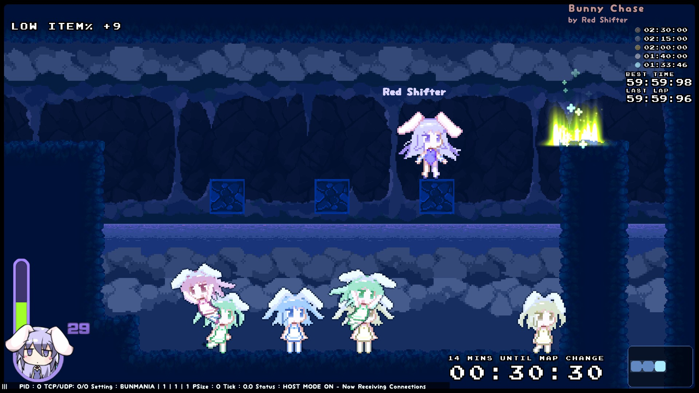
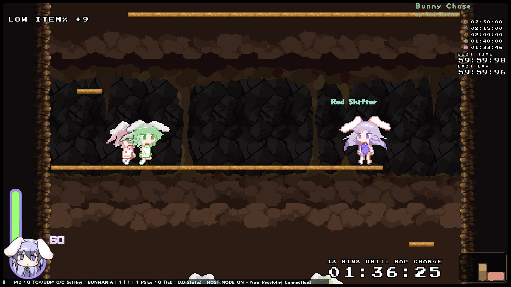

Visit the [Rabi-Ribi Custom Maps Portal](https://wcko87.github.io/rabi-ribi-maps/) to find other maps.

# WARNING: THIS VERSION IS NO LONGER KEPT UP-TO-DATE. PLEASE CHECK THE VERSION ON STEAM WORKSHOP.

# Bunny Chase
by Red Shifter

[Download](Bunny_Chase_v1.02.zip)

## Description
Fake bunnies set a trap for Erina. Help her escape from trouble!

This is a Bunmania map where your ability to avoid fake bunnies is the main key to victory.

## Notes
- Requires basic Hidden Tech as detailed in the game's achievements (Reverse Wall Jump, Wall Kick)
- Contains a super secret bunny survival minigame

## Screenshots

## Version History
[v1.02 (2018-08-19)](Bunny_Chase_v1.02.zip)
- Added 1 Easter Egg at the beginning of the super secret bunny survival minigame

[v1.01 (2018-08-18)](Bunny_Chase_v1.0.1.zip)
- Added star rating (2/5)
- Removed note about DLC (the chosen difficulty appears to work correctly without Artbook)
- Removed DLC blocks from map

[v1.0 (2018-08-17)](Bunny_Chase_v1.0.zip)
- Initial upload.