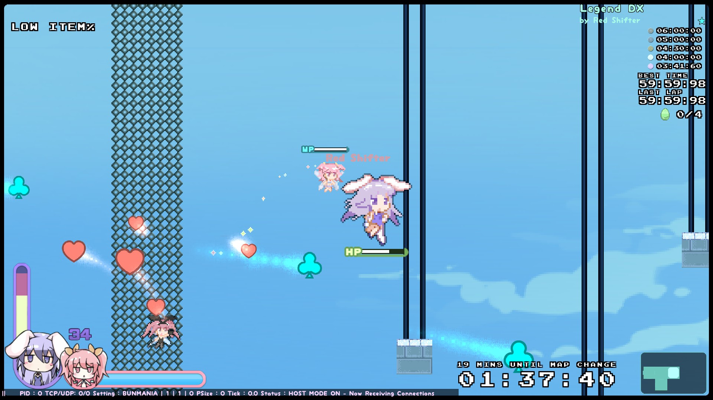
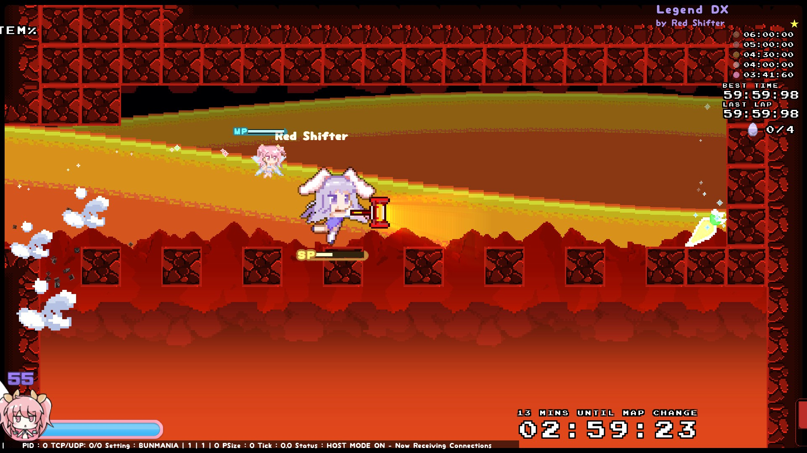

Visit the [Rabi-Ribi Custom Maps Portal](https://wcko87.github.io/rabi-ribi-maps/) to find other maps.

# WARNING: THIS VERSION IS NO LONGER KEPT UP-TO-DATE. PLEASE CHECK THE VERSION ON STEAM WORKSHOP.

# Legend DX
by Red Shifter

[Download](Legend_DX_1.00.zip)

## Description
Based on "The Legend of Bunny", this map contains a variety of environments and areas from it, condensed into a Bunmania map (instead of being the full size Metroidvania adventure).

## Notes
- Includes improvements and increased difficulty over The Legend of Bunny
- Not a single boss fight to speak of
- No special techniques required
- Contains 4 easter eggs

## Screenshots

## Version History
[v1.00 (2018-08-19)](Legend_DX_v1.00.zip)
- Initial upload.