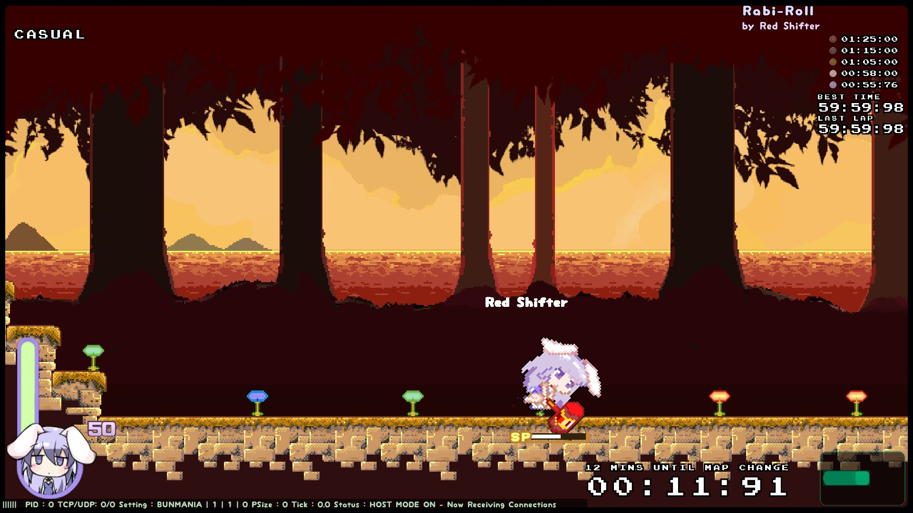
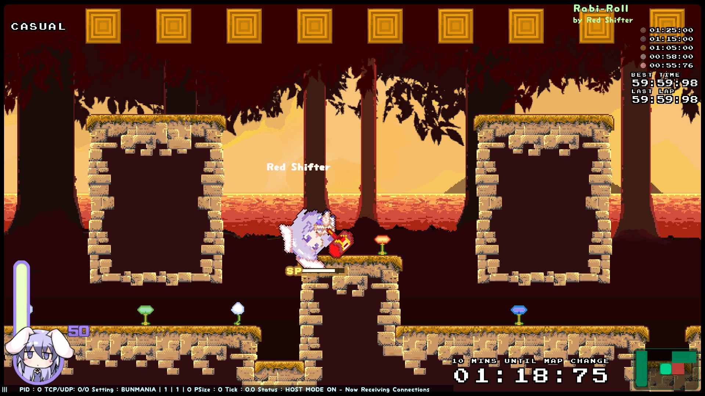

Visit the [Rabi-Ribi Custom Maps Portal](https://wcko87.github.io/rabi-ribi-maps/) to find other maps.

# WARNING: THIS VERSION IS NO LONGER KEPT UP-TO-DATE. PLEASE CHECK THE VERSION ON STEAM WORKSHOP.

# Rabi-Roll
by Red Shifter

[Download](Rabi-Roll_v1.03.zip)

## Description
Roll the rabbit as fast as you can!

This is a Bunmania map where you cover ground at an extremely fast rate. Use all the techniques available to you to take the fastest road and become the best roller!

## Notes
- Can be finished without special techniques
- Best route requires special techniques such as Launches and Slide Jump Bunny Strike (see Platforming Tricks Tutorial)
- Contains 3 Easter Eggs

## Screenshots

## Version History
[v1.03 (2018-08-20)](Rabi-Roll_v1.03.zip)
- Removed slide jump zip that was accidentally introduced in conversion from beta to complete versions

[v1.02 (2018-08-19)](Rabi-Roll_v1.02.zip)
- Reduced star rating to 1/5
- Added Easter Eggs to the secrets
- Made it possible to visit all the secrets in one run

[v1.01 (2018-08-18)](Rabi-Roll_v1.0.1.zip)
- Added star rating

[v1.0 (2018-08-16)](Rabi-Roll_v1.0.zip)
- Initial upload.

Beta versions
- Had 5.57 as a joke time