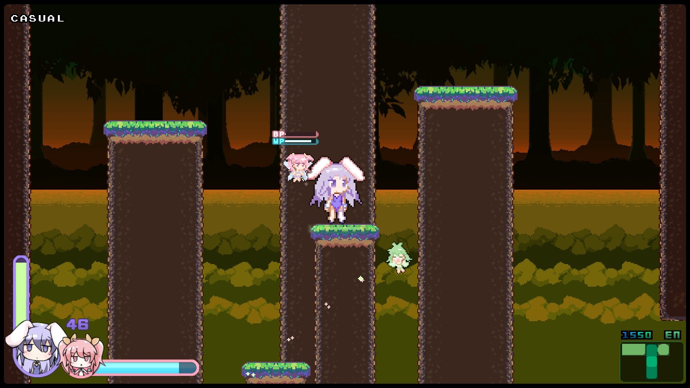
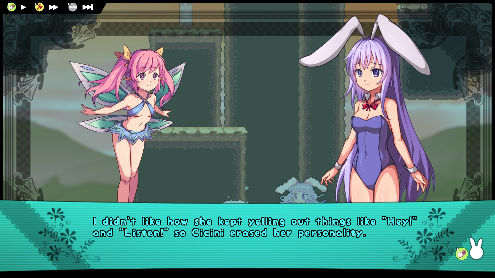
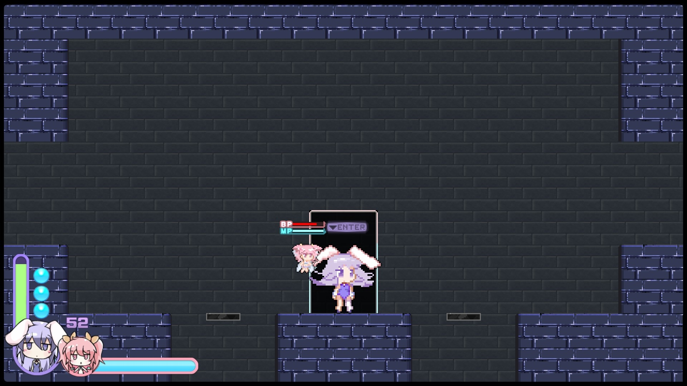
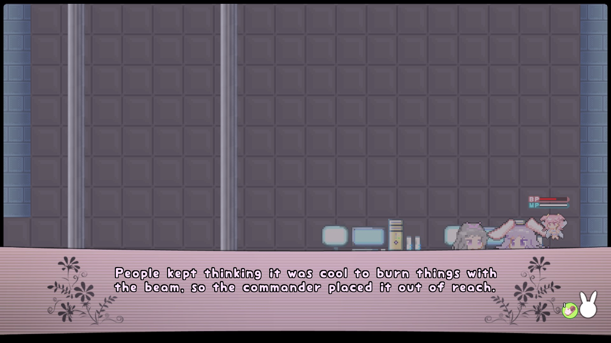

Visit the [Rabi-Ribi Custom Maps Portal](https://wcko87.github.io/rabi-ribi-maps/) to find other maps.

# WARNING: THIS VERSION IS NO LONGER KEPT UP-TO-DATE. PLEASE CHECK THE VERSION ON STEAM WORKSHOP.

# The Legend of Bunny
by Red Shifter

[Download](The_Legend_of_Bunny_v1.4.0.zip)

## Description
Cicini has been designing some kind of game inside the computer. She had been talking about it to everyone for a while, but she eventually stopped hanging out with people as often.

One day, Syaro called Erina over to the Computer Room. Cicini doesn't seem to be anywhere in sight...

This is a stand-alone Bunnytroidvania adventure where Erina journeys into the computer to save Cicini from her video game addiction. 

## Notes
- Contains a generic plot with stupid video game references and a bunch of NPCs telling you where to go
- It's on the harder side but should almost be reasonable on ~~Normal~~ Novice difficulty (can be changed in-game)
- Variety of areas to explore
- Lots of items to pick up
- Bakery
- ~~Crappy~~ Postgame
- No DLC required
- Easter Egg hunt 

## Screenshots

## Preview of Map Screen
[Partial Map Screen Preview (spoilers)](partial_map.jpg)

## Version History
[v1.4.0 (2019-04-04)](The_Legend_of_Bunny_v1.4.0.zip)
- Moved the Speed Boost to make it easier to find a completely different item
- Fixed an issue with Seana in the beta build
- Reminisced about the past...

[v1.3.3 (2019-02-18)](The_Legend_of_Bunny_v1.3.3.zip)
- Fixed the Black Tower for people with lower game quality  
- Expanded bakery
- Changed dialogue at developer platform 
- Corrected collision on a platform somewhere

[v1.3.1 (2019-02-14)](The_Legend_of_Bunny_v1.3.1.zip)
- Fixed the hints for the Easter Egg hunt

[v1.3.0 (2019-02-13)](The_Legend_of_Bunny_v1.3.0.zip)
- Added 5 Easter Eggs and a few extra items
- (Re)added Mana/Regen potions to the map
- Changed a bunch of items to be Lv.3
- Strange Box no longer detects the ending trophy
- Gave buffs for the Aruraune and Seana fights
- Shortened the commander's dialogue
- Made minor tweaks to each area
- ~~Added a few secrets and probably a new area or something~~
- Other stuff...

[v1.0.2 (2018-02-03)](The_Legend_of_Bunny_v1.0.2.zip)
- Added new facilities in the ravine ~~for filthy casuals~~ to make the game more fun
- Added a shortcut to/from the postgame boss
- Replaced Mana/Regen with Health/Attack potions (and added a couple more)
- Didn't do a thing about how many items are just stupidly hidden in walls
- Removed a slide tunnel that made people think they were softlocked
- Removed an autosave that actually could cause a softlock
- Made a badly-needed change to the 4-Minute Long Stupid Room
- Other stuff...

[v1.0.1 (2017-10-25)](The_Legend_of_Bunny_v1.0.1.zip)
- Changed wording of some lines based on player feedback.
- A bunch of minor changes based on watching other players play.
- Made it more obvious that there's something under the Hammer pedestal
- Other stuff...

[v1.0 (2017-10-24)](The_Legend_of_Bunny_v1.0.zip)
- Initial upload...